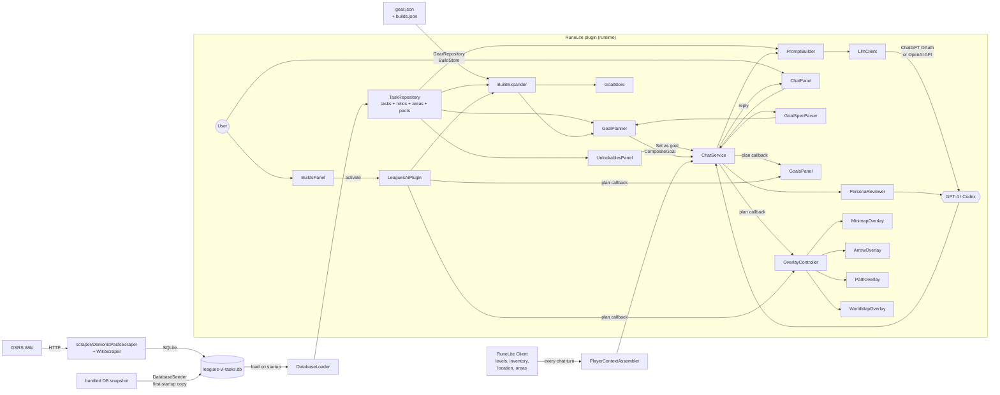

# Leagues VI AI Plugin

A RuneLite plugin that acts as an AI-powered coach for Old School RuneScape's **Leagues VI: Demonic Pacts**. It watches your game state, plans your tasks, explains your choices, and draws arrows on the ground so you know where to go.

**Status:** pre-launch (Leagues VI opens **2026-04-15**). Friends-only distribution for now. Expect sharp edges.

---

## What it does

- **Builds system.** Load a curated build ("Melee Bosser", "Ranged PvM DPS", "Skiller", etc.) from the Goals tab. The planner automatically chains every relic/area/pact/gear-task prerequisite. Export builds as JSON files to share with friends via Discord; import with one click.
- **Chat coach.** Ask "what should I do next?", "how do I unlock Grimoire?", or "plan out all the Karamja medium tasks" — the assistant reads your live inventory, levels, equipment, completed tasks, and unlocked areas, then answers with a real plan built from a local task database, not a hallucination.
- **Chained goal planner.** Click "Set as goal" on any relic, area, or demonic pact in the side panel. The planner computes the league-point gap between your current balance and the target's unlock cost, filters tasks by what you can actually do (skill gates, area unlocks, quest prereqs), and returns a specific batch of tasks ordered by points-per-effort.
- **Quest Helper-style overlays.** Once a plan is loaded, the plugin activates minimap arrows, a world arrow, path lines, and world map markers for the active step. Ported 1:1 from [Quest Helper](https://github.com/Zoinkwiz/quest-helper) under BSD-2-Clause. Tile, NPC, object, and ground-item highlights exist as hand-rolled placeholders pending a proper QH port (see `CLAUDE.md`).
- **Adversarial plan review.** Every generated plan is reviewed by three LLM personas (B0aty / Faux / a top UIM player) who each pick the single biggest flaw in the plan from their lens. Output shows as a banner at the top of the Goals tab.
- **Heartbeat coaching.** A short contextual coaching line updates every 60 seconds based on what you're doing (e.g. "Looking good — two more fishing spots and you've got Karamja easy done").
- **Pre-scraped data, no external dependencies at runtime.** A standalone scraper builds a SQLite database from the OSRS Wiki (tasks, areas, relics, pacts). A bundled snapshot is seeded on first install — no scraper run required to get started.

---

## Installation

### Prerequisites

- **Java 11.** `JAVA_HOME` must point at a JDK 11 install. On macOS with Homebrew:
  ```bash
  export JAVA_HOME=/opt/homebrew/opt/openjdk@11/libexec/openjdk.jdk/Contents/Home
  ```
- **Git** and a working RuneLite install (the plugin launches its own embedded RuneLite client in dev mode, so you don't need to touch your main RuneLite installation).

### Build and run

```bash
git clone https://github.com/kaicianflone/leagues-vi-ai-plugin.git
cd leagues-vi-ai-plugin

# Run the scraper once to populate the task database.
# Writes to ~/.runelite/leagues-ai/data/leagues-vi-tasks.db
./scraper/scrape.sh

# Launch RuneLite with the plugin loaded. NOT ./gradlew run — that would
# also trigger :scraper:run, which needs args and fails the build.
./gradlew runPlugin
```

RuneLite opens with the plugin active. Look for the devil emoji icon in the side panel.

---

## Getting started

### 1. Authenticate

The plugin auto-detects one of two LLM auth modes on startup:

1. **ChatGPT OAuth (preferred).** If you have the [Codex CLI](https://github.com/openai/codex) installed and logged in (it writes `~/.codex/auth.json`), the plugin will use your ChatGPT Plus credentials directly. Click the **"Sign in with ChatGPT"** button on first launch if the file doesn't exist yet.
2. **OpenAI API key (fallback).** Enter a platform API key in the Settings tab. The tab hides itself once auth is set.

No key, no OAuth, no chat. The scraper runs without either.

### 2. Load a build (fastest start)

Open the **Goals** tab and click **"Browse Builds"** at the bottom. Pick from 5 seeded archetypes:

- **Melee Bosser** — Bandos/Torva, Infernal Cape, Rigour+Piety relics, Kandarin/Wilderness areas
- **Ranged PvM DPS** — Armadyl/Masori, Twisted Bow, Pegasian Boots, Rigour
- **Skiller/Point Farmer** — Endless Harvest + Mythic relics, Fossil Island + Zeah, skilling pacts
- **Ironmeme One-Defence Pure** — void + fire cape, Vengeance Recoil pact
- **All-Rounder Starter** — rune gear, training relics, safe area picks

Click **Activate** — the planner chains every prerequisite task and loads the plan in one shot. Export/import builds as JSON to share with friends.

### 3. Set a manual goal

Open the **Goals** tab. Pick one of:

- Click **"Set as goal"** on a relic in the Unlockables accordion (e.g. Grimoire)
- Type `plan unlock Karamja` in chat
- Type `make me a plan for all the medium Kourend tasks`

The planner fires. Within a few seconds you'll see:

- A banner at the top of the Goals tab showing the composite goal
- An ordered task list in the Goals accordion
- A persona review banner explaining the plan's biggest weakness
- Overlays in-game pointing at the first task

### 4. Work the plan

The overlay follows the active step. When you complete a task, the planner advances to the next one. Ask the chat panel questions any time — it sees your live state and the active plan.

---

## Architecture

The plugin is 5 packages (`core`, `data`, `agent`, `overlay`, `ui`) plus a standalone scraper subproject. Data flows in one direction at runtime: from SQLite into the repository, through the agent layer, out to the UI and overlays.



### The goal-to-plan pipeline

The most important path through the plugin is what happens when you click "Set as goal" on Grimoire:

1. **`UnlockablesPanel`** fires a callback with the phrase `"plan unlock the Grimoire relic"`.
2. **`ChatService.maybeTriggerPlanner`** recognises the `plan ` prefix.
3. **`GoalSpecParser.parse`** regex-matches the shape, looks up "Grimoire" in `TaskRepository.findRelicByName`, and returns a `GoalSpec{type=RELIC, targetId="grimoire", unlockCost=N}`.
4. **`GoalPlanner.resolveCompositeGoal`**:
   - Computes `gap = unlockCost - playerContext.leaguePoints`
   - Filters `taskRepo.getAllTasks()` to achievable tasks (skills met, area unlocked, not completed)
   - Sorts by `points / difficultyTier` (points-per-effort)
   - Greedy-picks until the gap is closed
   - If no achievable set closes the gap, emits a child `AREA` goal pointing at the locked area that would contribute the most points
5. **`PlannerOptimizer`** reorders the task batch by location so you don't criss-cross the map.
6. **`ItemSourceResolver`** asks the LLM for the best ironman acquisition path for each required item (one batched call).
7. **`PersonaReviewer`** asks the LLM to roleplay B0aty + Faux + UIM adversarially reviewing the plan (one call). Verdict text lands in the Goals banner.
8. **`OverlayController`** activates the minimap, arrow, path, and world map overlays for the first step.
9. **`PromptBuilder`** now includes the full relics/areas/pacts reference + the active plan in every subsequent system prompt, so the LLM can answer follow-up questions with real data.

### Why a local SQLite database

OSRS Wiki rate-limits, and Leagues VI task data is ~1400 rows plus relics/areas/pacts reference. Paying that network cost per chat turn would be slow and fragile. The scraper runs once, writes to `~/.runelite/leagues-ai/data/leagues-vi-tasks.db`, and the plugin reads from that at startup. Re-run the scraper when the wiki publishes new data (notably: launch day 2026-04-15 for the real task list, filters, and unlock costs).

### What's ported from Quest Helper

Every overlay in `src/main/java/com/leaguesai/overlay/` is a 1:1 port from [Quest Helper](https://github.com/Zoinkwiz/quest-helper) under BSD-2-Clause. Minimap arrow clamping, world arrow rendering, path line drawing, and world map point behaviour all follow Quest Helper's reference implementation. See the attribution comment block at the top of each ported file.

---

## Project layout

```
leagues-vi-ai-plugin/
├── src/main/java/com/leaguesai/
│   ├── LeaguesAiPlugin.java      Top-level RuneLite plugin entrypoint + wiring
│   ├── LeaguesAiConfig.java      RuneLite config surface (API key, toggles)
│   ├── core/                     EventBus, state monitors, service plumbing
│   ├── data/                     TaskRepository, DatabaseLoader, DatabaseSeeder,
│   │                             GoalStore, BuildStore, GearRepository, VectorIndex,
│   │                             models/ (Build, GearItem, GearSlot, ...)
│   ├── agent/                    ChatService, GoalPlanner, GoalSpecParser,
│   │                             BuildExpander, ProximityOptimizer,
│   │                             PromptBuilder, PersonaReviewer, LLM clients
│   ├── overlay/                  Minimap/Arrow/Path/WorldMap overlays (QH ports)
│   └── ui/                       ChatPanel, GoalsPanel, BuildsPanel,
│                                 UnlockablesPanel, SettingsPanel, GoalAccordion
├── src/main/resources/
│   ├── gear.json                 25 Leagues-relevant gear items (slots, skill reqs,
│   │                             task overrides for launch-day reliability)
│   ├── builds.json               5 seeded build archetypes
│   └── leagues-vi-tasks.db       Bundled DB snapshot (seeded on first install)
├── src/test/java/com/leaguesai/  Unit tests (Mockito + JUnit 4) — 44 test files
├── scraper/                      Standalone scraper subproject
│   └── src/main/java/com/leaguesai/scraper/
│       ├── WikiScraper.java            Demonic Pacts League task scraper
│       ├── DemonicPactsScraper.java    Leagues VI relics/areas/pacts scraper
│       ├── TaskItemExtractor.java      Extracts equipment targets from task text
│       ├── ItemStatsScraper.java       Resolves item wiki IDs + stats
│       ├── HtmlParser.java             Jsoup-based wiki parsing
│       ├── SqliteWriter.java           UPSERT writer for all tables
│       └── TaskNormalizer.java         Skill name aliases, difficulty normalisation
├── scraper/scrape.sh             One-shot: runs both scrapers into the same DB
├── CLAUDE.md                     Project-specific rules and Phase 2 TODO
└── README.md                     You are here
```

---

## Development

```bash
# Run all tests (main + scraper subprojects)
JAVA_HOME=/opt/homebrew/opt/openjdk@11/libexec/openjdk.jdk/Contents/Home ./gradlew test

# Launch the plugin in dev RuneLite
./gradlew runPlugin

# Re-scrape the wiki (writes to ~/.runelite/leagues-ai/data/leagues-vi-tasks.db)
./scraper/scrape.sh
```

**Test policy:** overlays ported from Quest Helper have full Mockito-backed tests that verify actual draw calls (`graphics.draw(any(Shape.class))`, `setColor`, `setStroke`). Null-return assertions are coverage theater and not accepted. See `CLAUDE.md` for the full test discipline.

**Debug logging is intentionally loud** for the first couple weeks post-launch so friends can shake out issues. Don't strip the `MINIMAP DEBUG` or `CODEX DEBUG request body:` lines.

---

## Authentication details

- **`~/.codex/auth.json`** is consulted first. If present, `CodexOauthClient` talks to `chatgpt.com/backend-api/codex/responses` using your ChatGPT Plus credentials. Token refresh on 401 is automatic.
- **Settings tab** holds an `openaiApiKey` field as the fallback. Stored via RuneLite's config system (masked, not committed). Requests go to `api.openai.com/v1/chat/completions`.

The Settings tab hides itself once either auth mode is established. Chat and Goals tabs are the only ones visible in normal operation.

---

## Limitations and known gaps (pre-launch)

- **Task data is from the pre-launch wiki stub.** The scraper targets `Demonic_Pacts_League/Tasks` but the wiki page was incomplete at time of writing. Re-run `./scraper/scrape.sh` on launch day (2026-04-15) to get the real task list, filters, and unlock costs.
- **Unlock costs are zero across relics and areas** because the wiki hasn't published them. The planner treats zero-cost targets as "unknown cost" and returns the top-10 highest-value achievable tasks as a fallback suggestion.
- **Pact unlock tree is flat.** The wiki doesn't document parent/child pact relationships yet. The UI renders pacts as a tiered list (3 tiers); a proper tree view with dependency arrows is a post-launch task.
- **`GoalStore.isUnlocked`** is hardcoded `false` for everything. Auto-detecting in-game unlock state via varbits is a post-launch task.
- **Auto-completed quests** from the Leagues VI overview aren't wired into the planner's prereq checking yet.
- **Gear task linking** depends on `tasks.target_items` being populated. The bundled DB has this from the scraper run, but if a gear item's granting tasks are missing, BuildExpander falls back to goals-only mode with a banner.

See `CLAUDE.md` for the full Phase 2 launch-day task list.

---

## License and attribution

- **Plugin code:** [MIT](LICENSE).
- **Overlays ported from Quest Helper:** BSD-2-Clause. Original copyright preserved in each ported file's header comment block. See [ATTRIBUTIONS.md](ATTRIBUTIONS.md) for the list of ported files and the BSD-2-Clause text. These files keep their original license; MIT applies to everything else.
- **LLM-generated contributions** are marked with `Co-Authored-By: Claude` in commit trailers per [Anthropic's attribution guidance](https://docs.anthropic.com).

---

## Acknowledgements

- [Quest Helper](https://github.com/Zoinkwiz/quest-helper) by Zoinkwiz for the overlay reference implementation.
- The OSRS Wiki editors for maintaining the data this plugin depends on.
- B0aty, Faux, and the UIM community for the coaching style the persona reviewer mimics.
